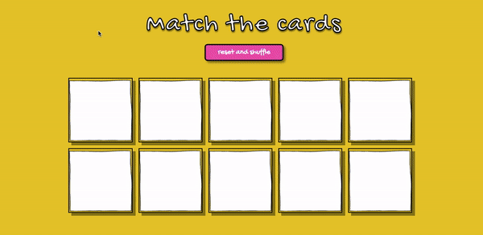

## Goal
Set up an express application for a memory card game where users select two cards and check if they are a match. Standard matching card game rules apply. 

## How it's made
Made using HTML, CSS, Javascript, Node.js, JSON, Express, EJS, MongoDB.

## Lesson Learned
I enjoyed thinking of new ways that apps can be more capturing of people's attention and more accessible. I ended up using sound effects for each click, reshuffle, reset, and game win -- so that was fun! Trial-ran it on young kids and they seemed to like it. 
